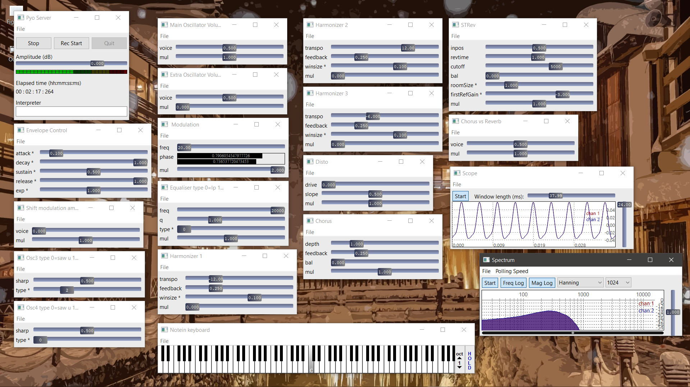
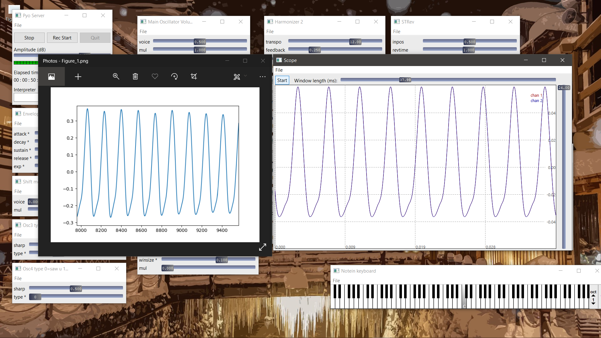
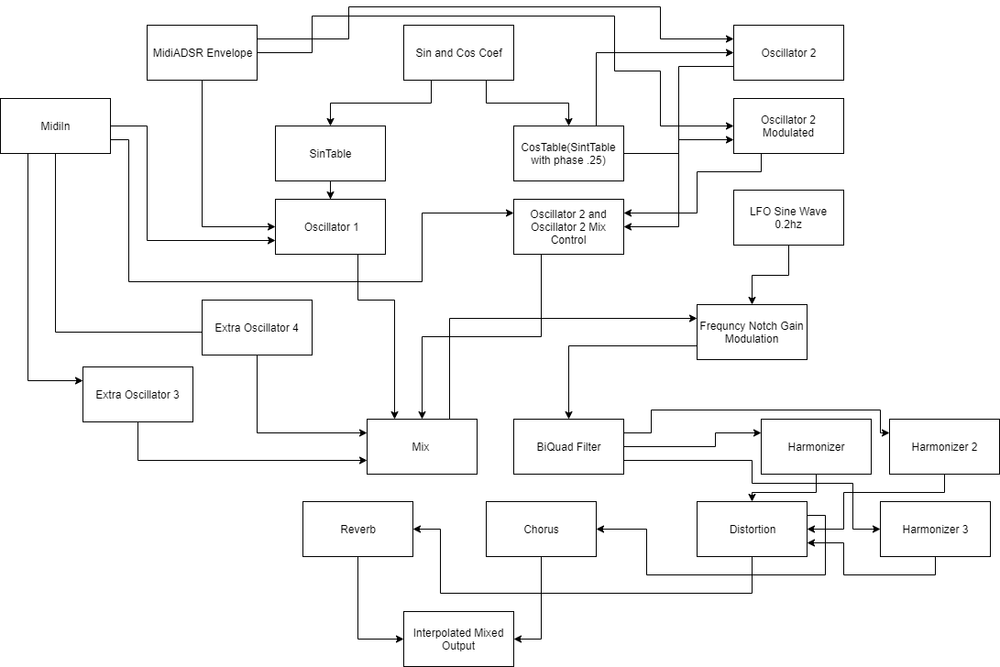

# S3_Smart_Sampling_Synthesiser

## Update

I am facing some problems running this project after updating versions on certains modules and it will be soon be revamped. I still plan to use the base concept but I'll see. I will update here the github repo link when I revamp this.
- []()

Central Repository of the S3 (Hopefully a vst soon) Smart Sampling Synthesiser

An additive synthesiser that generates wavetable from an input sample by using linear regression to find weights of harmonics. Currently being developed in Python (Pyo, PyQt5, wxpython).
In Future JUCE C++ or Rust looks a good option

## Collaborators

- [Kaushal Patil ](https://github.com/Kaushal1011)
- [Dhruvil Dave ](https://github.com/dhruvildave)
- [Prachee Javiya ](https://github.com/PracheeJaviya)


To run the code

```shell
python3 S3SynthMain.py
```

how to use:

1. Enter the name of the file from which you want to load wave profile.
2. Select the samples for which you want to train the file.
3. input a frequency that matches the pitch by selecting frequency from the output of program
4. upon entering frequency, the synthesiser will start.
5. start the server(make sure you have pyo installed), custommise parameter of envelope, oscillators, filter, and other effects.
6. play notes using the gui keyboard which pops up, you can also use computer keyboard to play once you have selected the keyboard window.(Make sure you have wxpython installed.use conda for easy installation)
7. change sound using synthesiser interface according to your needs.

Note :

1. ___Help regarding fucntions and classes can be found in help.md/help.pdf___
2. ___theoritical information can be found in theory___

## Interface



## Results



## Internal Routing


